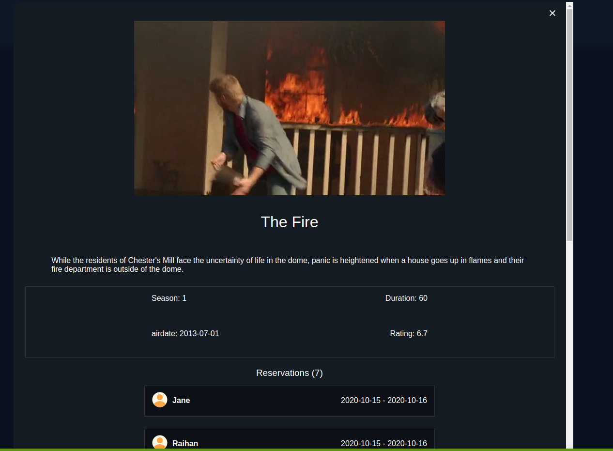

<a name="readme-top"></a>

<div align="center">

  
  <br/>

  <h3><b>Microverse README Template</b></h3>

</div>


# 📗 Table of Contents

- [📗 Table of Contents](#-table-of-contents)
- [🎥 RSL Media ](#-rsl-media-)
  - [🛠 Built With ](#-built-with-)
    - [Tech Stack ](#tech-stack-)
    - [Key Features ](#key-features-)
  - [🚀 Live Demo ](#-live-demo-)
  - [💻 Getting Started ](#-getting-started-)
    - [Prerequisites](#prerequisites)
    - [Setup](#setup)
    - [Install](#install)
    - [Usage](#usage)
  - [👥 Author ](#-author-)
  - [How to access the database?](#how-to-access-the-database)
  - [🤝 Contributing ](#-contributing-)
  - [⭐️ Show your support ](#️-show-your-support-)
  - [🙏 Acknowledgments ](#-acknowledgments-)
  - [📝 License ](#-license-)


# 🎥 RSL Media <a name="about-project"></a>

>
> **The RSL Media** is a Microverce group project. It's an online entertainment streaming source for TV shows, movies. All data is preserved thanks to the external **tvmaze** API service.

## 🛠 Built With <a name="built-with"></a>

### Tech Stack <a name="tech-stack"></a>

> We used HTML, CSS, Javascript ES6, Webpack and Jest Unit testing.

<details>
  <summary>Client</summary>
  <ul>
    <li>HTML</li>
    <li>CSS</li>
    <li>JAVASCRIPT</li>
  </ul>
</details>


### Key Features <a name="key-features"></a>

> Some key feature of this project
Features
- **User can add like to their favourite show**
- **User can add comments**
- **User can reserve a show**

<p align="right">(<a href="#readme-top">back to top</a>)</p>


## 🚀 Live Demo <a name="live-demo"></a>

> ## Project demo picture
- [Live Demo Link](https://raihan2bd.github.io/js-capstone/)
>
> <div>
>
  
  
   
  <div>


<p align="right">(<a href="#readme-top">back to top</a>)</p>


## 💻 Getting Started <a name="getting-started"></a>

>Please follow the instructions to clone the repo
To get a local copy, follow these simple example steps.
Clone this repository or download the Zip folder:

### Prerequisites

>In order to check the linters errors make sure you have installed the [nodejs](https://nodejs.org)


### Setup

>Clone this repository to your desired folder: cd [folder] to navigate and run the below comand to clone the project

```sh
git clone https://github.com/raihan2bd/js-capstone.git
```


### Install

Install this project with:

download npm the packages
```sh
npm install --save-dev
```

### Usage

 > To see the project in your local browser first of all, go to the dist folder then open the index.html file.


<p align="right">(<a href="#readme-top">back to top</a>)</p>


## 👥 Author <a name="authors"></a>


👤 **Abu Raihan**

- GitHub: [@githubhandle](https://github.com/githubhandle)
- Twitter: [@twitterhandle](https://twitter.com/raihan2bd)
- LinkedIn: [LinkedIn](https://linkedin.com/in/raihan2bd)

👤 **Salwa Ballouti**

- GitHub: [@githubhandle](https://github.com/Salwa99)
- Twitter: [@twitterhandle](https://twitter.com/salwa-ballouti)
- LinkedIn: [LinkedIn](https://linkedin.com/in/salwa-ballouti)

👤 **Lugard Agu**

- GitHub: [@githubhandle](https://github.com/lugard1)
- Twitter: [@twitterhandle](https://twitter.com/Dsn3kings)
- LinkedIn: [LinkedIn](https://www.linkedin.com/in/lugard-agu-45bb05b6/)

<p align="right">(<a href="#readme-top">back to top</a>)</p>


<p align="right">(<a href="#readme-top">back to top</a>)</p>


## How to access the database?

- It's not available for now I'm still working on it, once it's available I'll update this answer.


## 🤝 Contributing <a name="contributing"></a>

Contributions, issues, and feature requests are welcome!

Feel free to check the [issues page](../../issues/).

<p align="right">(<a href="#readme-top">back to top</a>)</p>


## ⭐️ Show your support <a name="support"></a>

> Give a ⭐️ if you like this project!


<p align="right">(<a href="#readme-top">back to top</a>)</p>


## 🙏 Acknowledgments <a name="acknowledgements"></a>

> Without Microverse Help this project not compleated at all so thanks a lot Microverse for giving us this kind of opertunity.


<p align="right">(<a href="#readme-top">back to top</a>)</p>


## 📝 License <a name="license"></a>

This project is [MIT](./LICENSE) licensed.

<p align="right">(<a href="#readme-top">back to top</a>)</p>
